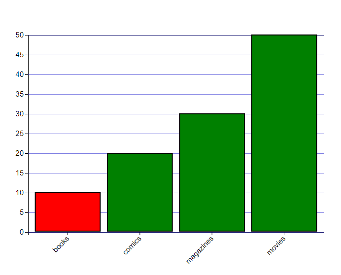
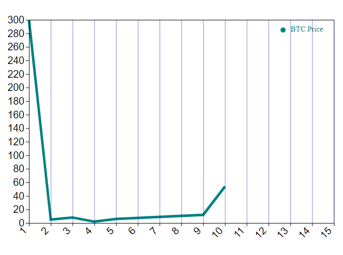

# Visualisation Tools for D3

## Usage:


[Tutorial 1](https://medium.com/@nickyblagoev/create-professional-graphics-and-plots-in-node-js-4cfc3935be0b)


Import and create a visualiser object with specific width and height:

```js
    const visualiser = require('visualiser');
    const inst = new visualiser({width : 1200, height : 1200});
```

To render (currently is equated to obtaining the HTML of the object - can be returned to a request):

```js
    inst.visualise();
```

All functions have parameters which can either be a function (so for which point return a value) or an array (which specifies for each value an intended result. The array doesn't need to be the same length as the values that map to it. Values are picked with i % array.length, as it loops around).

Currently supports:

## Radar (spider) chart:

Creates a radar chart:

```js
    const visualiser = require('visualiser');
    const inst = new visualiser({width : 1200, height : 1200});
    const exampleData = [{"attack": 4, "defence": 2, "wisdom": 10, "charisma": 2, "dexterity": 0}, {"attack": 6, "defence": 4, "wisdom": 0, "charisma": 10, "dexterity": 6}];
    const exampleFeatures = ["attack", "defence", "wisdom", "charisma", "dexterity"]
    inst.radar({data: exampleData, features: exampleFeatures});
```

<br/>
For redundancy we also provide spider chart with the same syntax as the radar.
<br/>
Requires a features array which specifies the features on each axis (can be of any length above 2). The data array contains objects which have a field for each of the features with a corresponding numeric value (between 0 and 10). The data array CAN contain other values as well! Other parameters are:<br/>

**maxRadius** -> the radius of the chart (default 100)<br/>

**fillColors** -> array of colour values for each object on the chart (default ["rgba(0,255,0,0.7)", "rgba(255,0,0,0.7)"])<br/>

**centerHorizontalOffset** -> the horizontal offset of the center of the spider/radar chart  (default 200)<br/>

**centerVerticalOffset** -> the vertical offset of the center of the spider/radar chart  (default 200)<br/>

**labelFontSize** -> the font size of the labels (default 10)<br/>

**ticks** -> array of numbers, giving which tick values to be shown on the spider chart (default [1, 2.5, 5, 7.5, 10] - this will show the position of the 1st, 2.5th, 5th, ect. values on the spider chart)<br/>

**strokeColor** -> function or array taking a tick value and mapping it to a colour (default (t) => "black")<br/>

**strokeHighlight** -> function or array taking a tick value and mapping it to width size (default (t) => t%5==0 ? 5 : 3)<br/>

**axisColor** -> function or array taking an axis number and mapping it to a colour (default (i) => "black")<br/>

**axisWidth** -> function or array taking an axis number and mapping it to a width size (default (i) => 1)<br/>


## Donut chart:

Creates a donut chart:

```js
    const visualiser = require('visualiser');
    const inst = new visualiser({width : 1200, height : 1200});
    const exampleDonutData = [{itm: 0, value: 10},{value: 35},{hs: 4, value: 8},{d: 4, value: 66}];
    inst.donut({data: exampleDonutData, colorRange: ["green", "#FF0000", "#0000FF"], text: "33%"});
```


<br/>
The data array contains any attributes, but it is mandatory to have a 'value' attribute in numerical form which specifies the value fot he given slice of the donut. Other attributes:<br/>

**outterRadius** -> the radius of the chart (default 100)<br/>

**innerRadius** -> the radius of the inner hole (ex 60)<br/>

**offsetX** -> offset of the graphic from the left side<br/>

**offsetY** -> offset of the graphic from the top side<br/>

**colorRange** -> an array of colours for ach element<br/>

**fontSize** -> font size of the inner text<br/>

**text**  -> string text to put in the middle of the donut<br/>

**textOffsetX** -> offset of the text from the left side of the hole<br/>

**textOffsetY** -> offset of the graphic from the top side of the hole<br/>

**toInclude** -> array of attributes to be included in the final elements! By default value and id are saved for each! YOU CAN USE THIS FOR INTERACTIVITY!<br/>

## Line (connected scatterplot) chart:

Creates a line of connected dots (NOTE: By setting the fill colour of a dote to none, dots will not be displayed):

```js
    const visualiser = require('visualiser');
    const inst = new visualiser({width : 1200, height : 1200});
    const exampleDataLine = [{x: 1, y: 300},{x: 2, y: 5},{x: 3, y: 8},{x: 4, y: 2},{x: 5, y: 6}];
    inst.line({data: exampleDataLine, lineWidth :  4});
```

<br/>
For redundancy we also provide connectedScatterPlot which does the same function with the same parameters<br/>
<br/>
The data array contains elements with each having an 'x' and 'y' attribute in numerical form. The line will connect the points in the order they appear in the array, so you might need to presort it according to the x axis. Other attributes:<br/>

**min_render** -> The smallest value on the y-axis (default undefined - will use the min(0, smallest data entry provided))<br/>

**max_render** -> The highest value on the y-axis (default undefined - will use 1.2*maximum value in data)<br/>

**offsetX** -> offset of the graphic from the left side<br/>

**offsetY** -> offset of the graphic from the top side<br/>

**pointRadius** -> the radius of each point (default 0)<br/>

**min_el** -> The smallest value on the x-axis (default undefined - inferred from data)<br/>

**max_el** -> The largest value on the x-axis (default undefined - inferred from data)<br/>

**tickCount** -> How many values to be on the x-axis<br/>

**lineWidth** -> width of line (default : 5)<br/>

**lineColor** -> color of line (default : "green")<br/>

**pointFill** -> string, which given point returns a colour (default: (d) => "green")<br/>

**toInclude** -> array of attributes to be included in the final elements! By default x and id are saved for each! YOU CAN USE THIS FOR INTERACTIVITY!<br/>

**xGridCount** -> number of grid lines on the x-axis<br/>

**yGridCount** -> number of grid lines on the y-axis<br/>

**xGridColour** -> callable, array, or string - for each tick on the x-axis provide a colour (default:  (i)=> "rgba(0,0,200,0.5)")<br/>

**yGridColour** -> callable, array, or string - for each tick on the y-axis provide a colour (default:  same as xGridColour)<br/>

**xFontSize** -> callable, array, or string - for each tick label on the x-axis define a font size (default: (i)=>"20px")<br/>

**yFontSize** -> callable, array, or string - for each tick label on the y-axis define a font size (default: same as xFontSize)<br/>

**xGridWidth** -> callable, array, or scalar - for each tick on the x-axis provide a thickness (default: (i)=> 1)<br/>

**yGridWidth** -> callable, array, or scalar - for each tick on the y-axis provide a thickness (default: same as xGridWidth)<br/>


## Multiple (connected) Lines Chart:

Same as a regular line, but this time you can put multiple lines on the same graphic:

```js
    const visualiser = require('visualiser');
    const inst = new visualiser({width : 1200, height : 1200});
    const exampleDataLines = [[{x: 1, y: 300},{x: 2, y: 5},{x: 3, y: 8},{x: 4, y: 2}],[{x: 6, y: 6},{x: 7, y: 20},{x: 8, y: 12},{x: 10, y: 108},{x: 12, y: 54}]];
    inst.lines({data: exampleDataLines,  max_el: 13, lineWidth : (i) =>4, max_render: 500, lineColor : (i) => i == 0 ? "blue" : "orange", pointFill : (i) => "rgba(0,0,0,0)"});
```

<br/>
The data array contains elements which each is an array containing elements with each having an 'x' and 'y' attribute in numerical form. The lines will connect the points in the order they appear in the array, so you might need to presort it according to the x axis. Other attributes:<br/>

**min_render** -> The smallest value on the y-axis (default undefined - will use the min(0, smallest data entry provided))<br/>

**max_render** -> The highest value on the y-axis (default undefined - will use the 1.2*maximum of data provided)<br/>

**offsetX** -> offset of the graphic from the left side<br/>

**offsetY** -> offset of the graphic from the top side<br/>

**pointRadius** -> the radius of each point<br/>

**min_el** -> The smallest value on the x-axis<br/>

**max_el** -> The largest value on the x-axis<br/>

**tickCount** -> How many values to be on the x-axis<br/>

**pointFill** -> callable, array, or string, which given the point returns a colour (default: (d) => "green")<br/>

**lineWidth** -> callable, array, or scalar, which given the index of the line, returns its width (default : (i) => 5)<br/>

**lineColor** -> callable, array, or string, which given the index of the line, returns the color of line (default : (i) => "green")<br/>

**toInclude** -> array of attributes to be included in the final elements! By default x and id are saved for each! YOU CAN USE THIS FOR INTERACTIVITY!<br/>

**xGridCount** -> number of grid lines on the x-axis<br/>

**yGridCount** -> number of grid lines on the y-axis<br/>

**xGridColour** -> callable, array, or string - for each tick on the x-axis provide a colour (default:  (i)=> "rgba(0,0,200,0.5)")<br/>

**yGridColour** -> callable, array, or string - for each tick on the y-axis provide a colour (default:  same as xGridColour)<br/>

**xFontSize** -> callable, array, or string - for each tick label on the x-axis define a font size (default: (i)=>"20px")<br/>

**yFontSize** -> callable, array, or string - for each tick label on the y-axis define a font size (default: same as xFontSize)<br/>

**xGridWidth** -> callable, array, or scalar - for each tick on the x-axis provide a thickness (default: (i)=> 1)<br/>

**yGridWidth** -> callable, array, or scalar - for each tick on the y-axis provide a thickness (default: same as xGridWidth)<br/>


## Scatterplot chart:

Creates a line chart where each element is emphasised with a circle:

```js
    const visualiser = require('visualiser');
    const inst = new visualiser({width : 1200, height : 1200});
    const exampleDataLine = [{x: 1, y: 300},{x: 2, y: 5},{x: 3, y: 8},{x: 4, y: 2},{x: 5, y: 6},{x: 4, y: 20},{x: 9, y: 12},{x: 2, y: 108},{x: 6, y: 54}];
    inst.scatterPlot({data: exampleDataLine, max_render: 300});
```

<br/>
For redundancy we also provide connectedScatterPlot which does the same function with the same parameters<br/>
<br/>
The data array contains elements with each having an 'x' and 'y' attribute in numerical form. The line will connect the points in the order they appear in the array, so you might need to presort it according to the x axis. Other attributes:<br/>

**min_render** -> The smallest value on the y-axis<br/>

**max_render** -> The highest value on the y-axis<br/>

**offsetX** -> offset of the graphic from the left side<br/>

**offsetY** -> offset of the graphic from the top side<br/>

**pointRadius** -> the radius of each point<br/>

**min_el** -> The smallest value on the x-axis<br/>

**max_el** -> The largest value on the x-axis<br/>

**tickCount** -> How many values to be on the x-axis<br/>

**pointFill** -> callable, array, or string, which given the point returns a colour (default: (d) => "green")<br/>

**toInclude** -> array of attributes to be included in the final elements! By default x and id are saved for each! YOU CAN USE THIS FOR INTERACTIVITY!<br/>

**xGridCount** -> number of grid lines on the x-axis<br/>

**yGridCount** -> number of grid lines on the y-axis<br/>

**xGridColour** -> callable, array, or string - for each tick on the x-axis provide a colour (default:  (i)=> "rgba(0,0,200,0.5)")<br/>

**yGridColour** -> callable, array, or string - for each tick on the y-axis provide a colour (default:  same as xGridColour)<br/>

**xFontSize** -> callable, array, or string - for each tick label on the x-axis define a font size (default: (i)=>"20px")<br/>

**yFontSize** -> callable, array, or string - for each tick label on the y-axis define a font size (default: same as xFontSize)<br/>

**xGridWidth** -> callable, array, or scalar - for each tick on the x-axis provide a thickness (default: (i)=> 1)<br/>

**yGridWidth** -> callable, array, or scalar - for each tick on the y-axis provide a thickness (default: same as xGridWidth)<br/>


## Bar chart:

Creates a bar chart where the height represents the chosen value:

```js
    const visualiser = require('visualiser');
    const inst = new visualiser({width : 1200, height : 1200});
    const exampleDataBars = [{"name": "books", value: 10}, {"name": "comics", value: 20}, {"name": "magazines", value: 30}, {"name": "movies", value: 50}];
    inst.bar({data: exampleDataBars, colorBar: (d) => d.name == "books" ? "red" : "green"});
```



<br/>
The data array contains elements with each having a 'name' and 'value' attribute in string and numerical form respectively. Other attributes:<br/>

**XOffset** -> offset of the graphic from the left side<br/>

**YOffset** -> offset of the graphic from the top side<br/>

**max_val** -> highest value to display on y-axis (by default undefined meaning that the value will be found from the data given)<br/>

**min_val** -> smallest value to display on y-axis (by default undefined meaning that the value will be found from the data given. NOTE: in order for all data to be displayed the value taken from data is biased by an additional factor of -1)<br/>

**axisYHeight** -> height of y-axis<br/>

**axisXWidth** -> width of x-axis<br/>

**colorBar** -> function or array which given an element returns a colour for it<br/>

**fontSize** -> function or array which given an element returns a font size for it<br/>

**yFontSize** -> give the font for the y-axis<br/>

**toInclude** -> array of attributes to be included in the final elements! By default value and id are saved for each! YOU CAN USE THIS FOR INTERACTIVITY!<br/>

**yGridCount** -> number of grid lines on the y-axis (by default -1, meaning it will use the value of the max_el)<br/>

**yGridColour** -> callable - for each tick on the y-axis provide a colour (default:  (i)=> "rgba(0,0,200,0.5)")<br/>

**yGridWidth** -> callable - for each tick on the y-axis provide a thickness (default: (i)=> 1)<br/>


## Area Under The Curve chart:

Creates an line chart with area under it highlighted:

```js
    const visualiser = require('visualiser');
    const inst = new visualiser({width : 1200, height : 1200});
    const exampleAuc = [{x: 0, y: 300},{x: 2, y: 5},{x: 3, y: 8},{x: 4, y: 2},{x: 5, y: 6},{x: 9, y: 12},{x: 12, y: 108},{x: 16, y: 54}]
    inst.auc({data: exampleAuc, lineWidth : 4, max_render: 500, max_el: 16, areaColor: "rgba(0,170,170,0.6)", lineColor: "rgb(0,200,255)", pointRadius: 0});
```


<br/>
The data array contains elements with each having an 'x' and 'y' attribute in numerical form. The line will connect the points in the order they appear in the array, so you might need to presort it according to the x axis. Other attributes:<br/>

**min_render** -> The smallest value on the y-axis (default 0)<br/>

**max_render** -> The highest value on the y-axis (default 1000)<br/>

**offsetX** -> offset of the graphic from the left side<br/>

**offsetY** -> offset of the graphic from the top side<br/>

**pointRadius** -> the radius of each point<br/>

**min_el** -> The smallest value on the x-axis<br/>

**max_el** -> The largest value on the x-axis<br/>

**tickCount** -> How many values to be on the x-axis<br/>

**lineWidth** -> width of line (default : 5)<br/>

**lineColor** -> color of line (default : "green")<br/>

**pointFill** -> function or array, which given point returns a colour (default: (d) => "green")<br/>

**areaColor** -> the color of the area under the curve (default: "rgba(0,10,190, 0.6)")<br/>

**toInclude** -> array of attributes to be included in the final elements! By default x and id are saved for each! YOU CAN USE THIS FOR INTERACTIVITY!<br/>

**xGridCount** -> number of grid lines on the x-axis<br/>

**yGridCount** -> number of grid lines on the y-axis<br/>

**xGridColour** -> callable, array, or string - for each tick on the x-axis provide a colour (default:  (i)=> "rgba(0,0,200,0.5)")<br/>

**yGridColour** -> callable, array, or string - for each tick on the y-axis provide a colour (default:  same as xGridColour)<br/>

**xFontSize** -> callable, array, or string - for each tick label on the x-axis define a font size (default: (i)=>"20px")<br/>

**yFontSize** -> callable, array, or string - for each tick label on the y-axis define a font size (default: same as xFontSize)<br/>

**xGridWidth** -> callable, array, or scalar - for each tick on the x-axis provide a thickness (default: (i)=> 1)<br/>

**yGridWidth** -> callable, array, or scalar - for each tick on the y-axis provide a thickness (default: same as xGridWidth)<br/>


## Legend:

Adds a legend:

```js
    const visualiser = require('visualiser');
    const inst = new visualiser({width : 1200, height : 1200});
    const exampleDataLines = [[{x: 1, y: 300},{x: 2, y: 5},{x: 3, y: 8},{x: 4, y: 2}],[{x: 6, y: 6},{x: 7, y: 20},{x: 8, y: 12},{x: 10, y: 108},{x: 12, y: 54}]];
    let lines = inst.lines({data: exampleDataLines,  max_el: 13, lineWidth : (i) =>4, max_render: 500, lineColor : (i) => i == 0 ? "blue" : "orange", pointFill : (i) => "rgba(0,0,0,0)"});
    lines.legend({data: ["Profits", "Decline"], colours: ["blue", "orange"]})
```



<br/>
The data array consists only of strings. Other parameters:<br/>

**colours** -> array, callable, or just a string - the colours of each dot and text (default: green)<br/>

**y** -> the starting y of the legend (default height of visualiser object*0.15)<br/>

**x** -> the starting x of the legend (default width of visualiser object - 0.5*width of visualiser object)<br/>

**distance_elms** -> distance between elements (default 25) <br/>

**dotRadius** -> radius of each dot (default 5)<br/>

**backgroundColour** -> specifies the background of the legend (default: rgba(240,240,240,0.8))<br/>